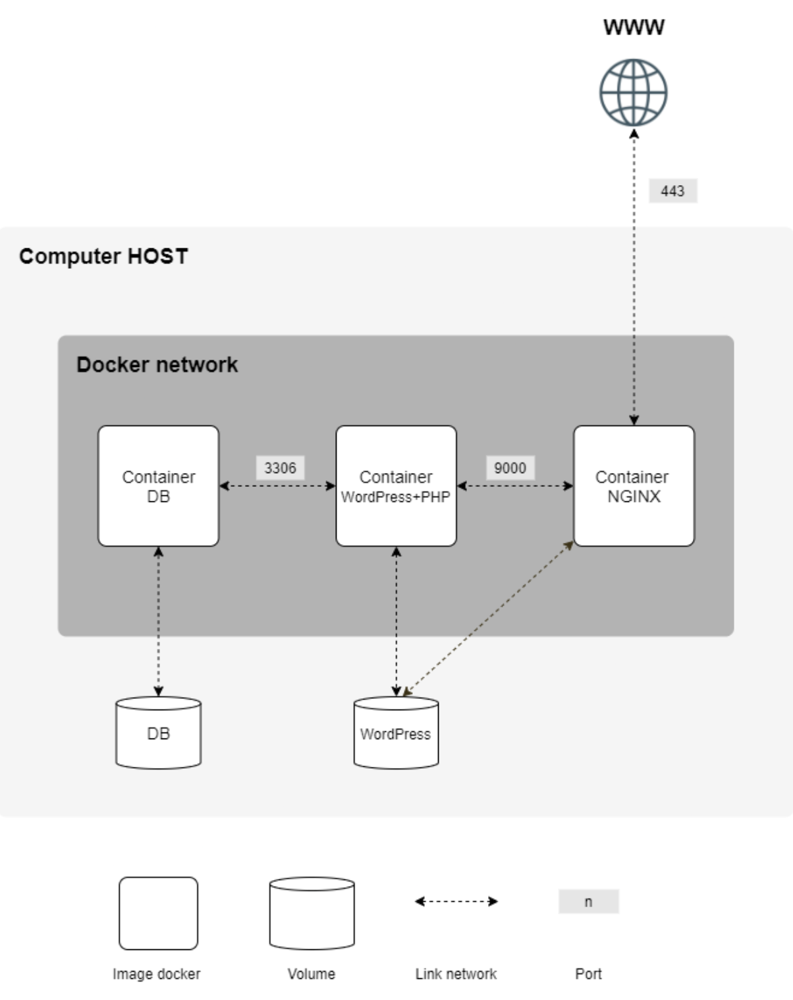

# INCEPTION
## 42 Cursus project - Inception

In this projects I must create a several Docker images
to run it as services of a concrete network infrastructure, according to the next image.

On this project I must use a dockerfile for each service image, and a docker-compose file to build and run the complete network. For more information about this project, you can read the subject in [english](subject/en.subject.pdf) or [spanish](subject/es.subject.pdf).

As we must developed it on a linux virtual machine with graphical support, I choose Debian Bulleye. Once you have it instaled, you can find a Bash script to configure the virtual machine in the file [debian_setup.sh](inception/srcs/requirements/tools/debian_setup.sh), that must be run only once before to try my solution because it configure and install all the things needed in this virtual machine to work properly in this project.

All the files and the mandatory Makefile are include in the folder [inception](inception/).

###Graded: 
